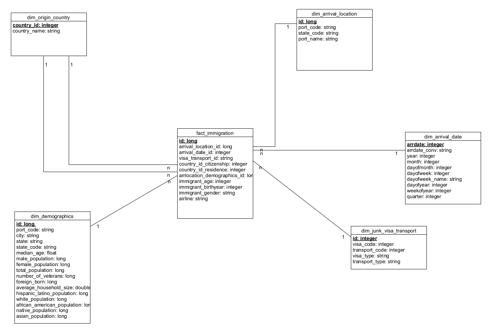

# Data Engineering Nanodegree Program Capstone Project

# Data Lake for US Immigration Data

## 1. Introduction and Scope

### 1.1. Purpose

In this project, we want to design a data lake and the respective pipeline in order to populate the target structure. This data lake will serve as source for analytical purposes as analysts might be interested in gaining some insights into US immigration data.
Using this data lake, following topics could be investigated:
- Which cities have the most visitors?
- Is there any correlation between demographical structure of a destination city and origin of immigrant?
- Correlation between age group of immigrant and destination
- How do histograms regarding visitor amount per season & city look like?
- Which purpose do immigrants have (based on visa type)?
- What are the most used transport modes as travelling to USA?

### 1.2. Scope

Based on the mentioned purpose, we will be applying partially Kimball principles to build clear relations between structure components. In this manner, we will build a star schema consisting of a fact table and dimension tables.
This data lake will cover the following subjects:
- Arrival locations in the United States
- Demographical data about arrival locations
- Arrival date of immigrants
- Visa type of immigrants
- Tranport mode of immigrants
- Origin of immigrants
    - Citizenship
    - Residence country
- Birthyear of immigrants (considered to be a degenerate dimension, not necessarily required, may be null)
- Age of immigrants (considered to be a degenerate dimension,not necessarily required, may be null)

__Since the regarding source data is highly granular, the fact table will be a type of factless fact table and will not contain preaggregated values. This will enable to generate flexible aggregations based on the specific interests of the consumer of the data.__ 

## 2. Datasets

There are two datasets used as source data and a supplemental dataset which is describing the labels/codes in source datasets.

### 2.1 I94 Immigration Data

 - This data comes from the US National Tourism and Trade Office. It is provided by Udacity in the workspace as parquet files and accessable using the path:
 __/home/workspace/sas_data__
 - This dataset is highly granular und represents details regarding transactions on arrival ports.
   
### 2.2 U.S. City Demographic Data

 - This data comes from OpenSoft.
 - This dataset includes details abour demographical structure of listed cities.
 - Data has the format csv and is accessible on Udacity project workspace under the path:
 __/home/workspace/us-cities-demographics.csv__
   
### 2.3 I94 SAS Labels Descriptions

 - This supplementary data serves as dictionary for I94 Immigration Data which will be utilized to produce mappings between codes and labels. 
 - It will helpful to ensure higher level of data quality during the execution of the ETL process
 - Data is accessible on Udacity project workspace using the path: 
   __/home/workspace/I94_SAS_Labels_Descriptions.SAS__

## 3. Data Quality / Data Wrangling Concept

- As generating maps, labels and codes which have already been labeled as "unknown", "invalid" or "collapsed" will be clustered in a single group and will get a single common ID.
- Fields containing numeric data get loaded as string fields. They will be converted into appropiate format (float, double, int or long) during the transformation process.
- "arrdate" field in data "I94 Immigration Data" is a numeric field which represents day interval between 01.01.1960 and arrival date of immigrant. This will be converted into date format during processing.
- demographics data is not normalized based on city and state since data has the column "Race" having different values. Since demographics table is considered to be a dimension in our structure having key city and state, a normalization process will be performed using aggregation on the column "Race" (SQL Pivot function)
- To ensure quality inline: 
    - occurrence of each key field will be calculated in the midlayer of processing and only those will be loaded into dimension table which is not violating the required uniqueness (where logically applicable)
    - union operator will be used for applicable fields (for example in case of combining two columns from immigration data "i94cit" & i"94res" that are representing country ids)
    - "distinct" will be used (where logically applicable)
    - preprocessed code_label_maps will be used in joins while creating dimension and fact tables. This will avoid null values in key fields.
- To ensure quality online: 
    - two check steps will be applied after each load process
        - first check will cover if data is loaded into target
        - second check will cover if the expected amount of columns is there. Particularly, this check will be important as we are importing data from a csv file using a certain delimeter. This is also valid for the scenario as importing data into a csv file, for example generating code maps.

## 4. Target Structure Design

### 4.1. Why Data Lake as Target Structure

The processed data will be saved in parquet files in the filesystem. So, we can process our data in a flexible way by still ensuring some structure in the target data. This will give the ability to consumers to process and analyze data in a fluid manner using the appropriate tools which are already highly available on the market.

### 4.2 Why Star Schema

A relational model like Star Schema, even if it is not implemented in a traditional data warehouse, makes it easier to understand the structure including the relation between components. In this structure, aggregations can be performed using defined dimensions with simple sql queries. Since the main purpose of this data lake to serve analytical processes, star schema will be applied as design pattern due to its simplicity and clearness.

### 4.3. Tables

We have two types of tables: Core Tables and Supplemental Tables

#### 4.3.1 Core Tables

These tables are direct components of the star schema:

__Dimension Table: arrival_date__
- This table contains all arrival dates and derived information like year, calendar week, month etc. The required data gets extracted from source immigration data set.

__Dimension Table: origin_country__
- This table contains countries and specific identifiers. Content of this table is created by using data from immigration data set and related map extracted from I94 SAS Labels Descriptions.
- serves two columns in the fact table: citizenship and residence

__Dimension Table: arrival_location__
- This table contains all arrival ports recorded in immigration data set. While building this table, related map (port_map) is utilized which is extracted from data I94 SAS Labels Descriptions.

__Dimension Table: demographics__
- This table contains demographical information for a particular city in a particular state. The content gets provided using data from immigration data, demographichs data and port map.

__Dimension Table: junk_visa_transport__
- This table is designed as junk dimension combining two possible dimensions visa and transport mode. Since these table have too few rows, both data are combined and each combination gets a specific id which is referenced just once in the fact table. So, we can avoid one more join and keep fact table a little bit leaner. Related map tables used in the process are map_mode and map_visa.

__Fact Table: immigration__
- This table is the fact table of the star schema and designed as a factless fact table including only records of transactions without having any aggregated data. This will allow users to pull customized aggregations depending on dimensions.

The corresponding data dictionary for the main tables is as follows:

__Fact Table: immigration__

| Column Name (Data Type)  | Description  |
|---|---|
| id (long)  | Primary Key |
|arrival_location_id (long) | Reference for the arrival location of immigrant. FK to the arrival_location dimension table; not null  |
|  arrival_date_id (long) | Reference for the arrival date of immigrant. FK to the arrival_date dimension table; not null  |
| visa_transport_id (integer) | Reference for the visa type and transportation mode of immigrant FK to the junk_visa_transport dimension table; junk dimension; ; not null  |
| country_id_citizenship (long) | Reference for the citizenship of immigrant; FK to the origin_country dimension table; ; not null  | 
| country_id_residence (long)  |  Reference for the residence of immigrant; FK to the origin_country dimension table; ; not null |
| arrlocation_demographics_id (long) | Reference for the demographics info of arrival location; FK to the demographics dimension table; ; not null |
| immigrant_age (integer) | Age of immigrant ; degenerate dimension  |
| immigrant_birthyear (integer)  | Birthyear of immigrant; degenerate dimension  |
| immigrant_gender (string)   | Gender of immigrant; degenerate dimension  |
| airline (string)   | Code of airline used by immigrant; degenerate dimension  |

__Dimension Table: arrival_date__

| Column Name (Data Type)  | Description  |
|---|---|
| arrdate (integer)  | Primary Key; numeric value in the source data |
|arrdate_conv (string) |Arrival date, calculated value from arrdate as iso format|
|  year (integer) | Year  |
| month (integer)  | Month  |
| dayofmonth (integer)  | Day (1-31)  |
| dayofweek (integer) |  1-7 |
| dayofweek_name (integer)  | Day name (Mon,Tue,Wed,Thu,Fri,Sat,Sun)  |
| dayofyear (integer) | 1-366  |
| weekofyear (integer)  | 1-53  |
| quarter (integer) | 1-4  |

__Dimension Table: origin_country__

| Column Name (Data Type)  | Description  |
|---|---|
| country_id (integer)  | Primary Key  |
| country_name (string) | Country name |

__Dimension Table: arrival_location__

| Column Name (Data Type)  | Description  |
|---|---|
| id (long)  | Primary Key |
|port_code (string) | 3 characters code for arrival port / City|
|  state_code (string) | 2 characters code for arrival state  |
| port_name (string) | Name of arrival location/city  |

__Dimension Table: demographics__

| Column Name (Data Type)  | Description  |
|---|---|
| id (long)  | Primary Key |
|port_code (string) |code for arrival port / City|
|  city (string) | City name  |
| state (string) | State name  |
| state_code (string) | State code  |
| median_age (float)  |  Median age value for the population of a city |
| male_population (long) | Male population |
| female population (long) | Female population  |
| total_population (long)   | Total population  |
| number_of_veterans (long)   | Number of veterans  |
| foreign_born (long)   | Number of foreign born people  |
| average_household_size (double)  | Average household size  |
| hispanic_latino_population (long)  | Hispanic/Lationo population  |
| african_american_population (long)  | African American population  |
| native_population (long)   | Native Indian population  |
| asian_population: long  | Asian population |

__Dimension Table: junk_visa_transport__

| Column Name (Data Type) | Description  |
|---|---|
| id (long)  | Primary Key |
|visa_code (integer) | Visa Code (1,2,3) |
|  transport_code (integer) | Mode of transportation (1,2,3,9)  |
| visa_type (string) | Visa Type Description (Pleasure, Student, Business)  |
| transport_type (string) | Transportation Mode Description (Air, Land, Sea, Not Reported)  |

__Schema Design__

<!--[Star Schema](images/star_schema_immigration.png)-->

#### 4.3.2 Supplemental Tables

__Staging Table: staging_immigration_table__
- This table is used to stage the immigration data "I94 Immigration Data"

__Staging Table: staging_demographics_table__
- This table is used to stage the demographic data "U.S. City Demographic Data"

__Mapping Table: map_cit_res__
- This table contains country codes and labels which are listed in the source data in field i94cit (citizenship) and i94res (residence). It is generated by combining and processing of data dictionary "labels data" and source immigration data.

__Mapping Table: map_port__
- This table contains port codes and labels listed in the source (immigration data) as i94port. Map gets generated by combining and processing of data dictionary "labels data" and source immigration data.

__Mapping Table: map_mode__
- This table contains transport mode code and labels. Generated by combining and processing of data dictionary "labels data" and source immigration data.

__Mapping Table: map_visa__
- This table contains visa codes and labels. Generated by combining and processing of data dictionary "labels data" and source immigration data. In this case, the dictionary of visa data is created manually by reading the values from labels data. 

__Mapping Table: map_addr__
- This table contains U.S state codes (i94addr) and related labels. Generated by combining and processing of data dictionary "labels data" and source immigration data.

## 5. Pipeline Design / Implementation

### 5.1 Tool/Technology Decision

We build our pipeline using PySpark. This decision is based on following features of Spark:

-  In our project, we are working with different data formats and our goal is to build a data lake. Spark gives us the ability to load and process many different data types. As we are reading and extracting data from flat files, we can load all data into spark dataframes or rdds and use sql queries to gain insights or transform the data. At the end, we can write our transformed data back into files. 
- In case of dealing with huge datasets, we can control our data organization by just repartitioning. 
- Fast in-memory calculations are useful for our purpose.
- Spark helps us to build a scalable structures. As we are implementing/prototyping our concept on a single machine, we can scale up our concept for scenarios like distributed processing on cloud with a decent effort.
- Available libraries for sql and programming languages in spark ecosystem are further points that we consider as we decide to use Spark in this project.

### 5.2 Processing Steps

Process can be considered in three logical stages:

#### 5.2.1 Stage source data

In this stage, we load our source immigration data (format: parquet) and demographic data (format: csv) into staging tables mentioned above. As loading data, we drop malformed data. 
This step is followed by quality check for each table where it is checked if table has data and expected amount of columns. 

#### 5.2.2 Build mappings

Here, we read and extract data from staged immigration data and use labels data to generate mappings which will be used as creating the dimension tables. On each map table, quality check gets performed.

#### 5.2.3 Create target tables

- Based on generated mapping tables and staged source data, core tables of the concept are populated in this stage. 
- Dimension tables get populated and written into parquet files.
- Fact table gets populated using dimension tables and written into parquet files.
- Data quality concept which is discussed in Section 3 is here applied as well. 

## 6. Verification of Model

In this section, we will demonstrate some queries and results to prove that the created model works as expected. 

The related notebook used for the tests is residing in the workspace and listed in section 8 (tests_with_final_model.ipynb). This notebook contains more queries than listed here. For more tests refer to mentioned notebook.

__Query 1: list top 5 cities with the most visitos (all time)__
~~~~sql
spark.sql("""select dal.port_name as city, count(*) visitor_amount
    from fact_immigration fi 
    join dim_arrival_location dal 
    on fi.arrival_location_id=dal.id 
    group by dal.port_name
    order by count(*) desc limit 5
""").show()
~~~~

__Result__:

__Query 2: top 5 most visited cities by CHINA, PRC citizens and asian population ratio in those cities__
~~~~sql
spark.sql("""select doc.country_name as citizenship, dal.port_name as city, count(*) amount_vistor, round((dd.asian_population/dd.total_population)*100,2) as ratio_asian_population
    from fact_immigration fi 
    join dim_origin_country doc
    on fi.country_id_citizenship = doc.country_id and doc.country_name='CHINA, PRC'
    join dim_arrival_location dal
    on fi.arrival_location_id=dal.id
    join dim_demographics dd
    on fi.arrlocation_demographics_id = dd.id
    group by doc.country_name,dal.port_name,(dd.asian_population/dd.total_population)*100 
    order by count(*) desc
    limit 5
""").show()
~~~~

__Query 3: top 5 arrival locations for visitors with visa type Student__
~~~~sql
spark.sql("""select visa_type,
    dal.port_name as city, 
    count(*) amount
    from fact_immigration fi 
    join dim_junk_visa_transport djvt 
    on fi.visa_transport_id = djvt.id and visa_type in ('Student')
    join dim_arrival_location dal
    on fi.arrival_location_id = dal.id
    group by visa_type,dal.port_name
    order by count(*) desc
    limit 5
""").show()
~~~~

## 7. Discussion on different Scenarios

### Scenario 1: The data was increased by 100x.
- In this we can consider to move our structure to AWS EMR cluster and extend our concept to process distributed data sets. At this point, we should consider to repartition our data in order to minimize shuffling overhead. In EMR, hardware configuration can be adjusted depending on needs. 

### Scenario 2: The pipelines would be run on a daily basis by 7 am every day.
- This task can be handled by integrating Apache Airflow in our concept. The tasks can be scheduled and performed.

### Scenario 3: The database needed to be accessed by 100+ people.
- By distributing and replicating data, more consumers can be served.
- One option is to build a cloud data warehouse on the top of this structure. Amazon Redshift could be a choice since it handles big datasets (also distributed) very efficiently and allows to load parquet files.

## 8. Description of Files in the Repository

__1. sql_queries.py__
Python script contatining all sql statements used in this project.

__2. etl.py__
Python script contaning the pipeline code.

__3. tests_with_final_model.ipynb__
Notebook used to test some analytical queries on final model.

## 9. How to run
0. pip install pyspark (if pyspark not yet installed)
1. Rund etl.py

